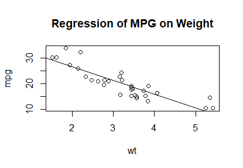
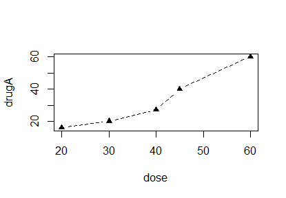
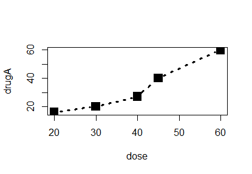
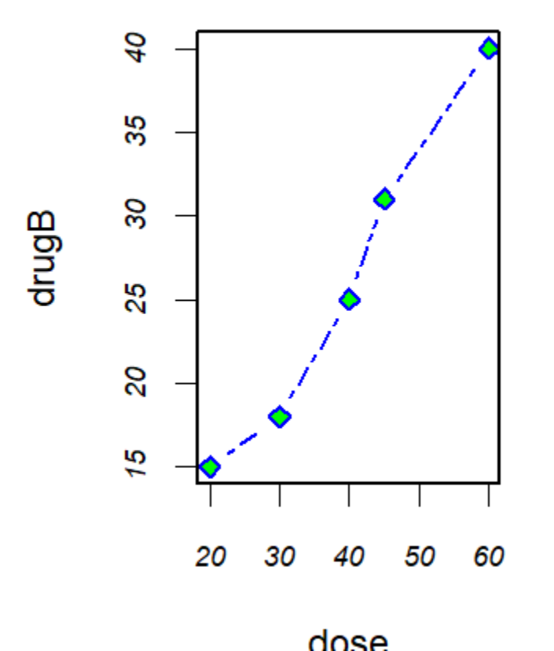
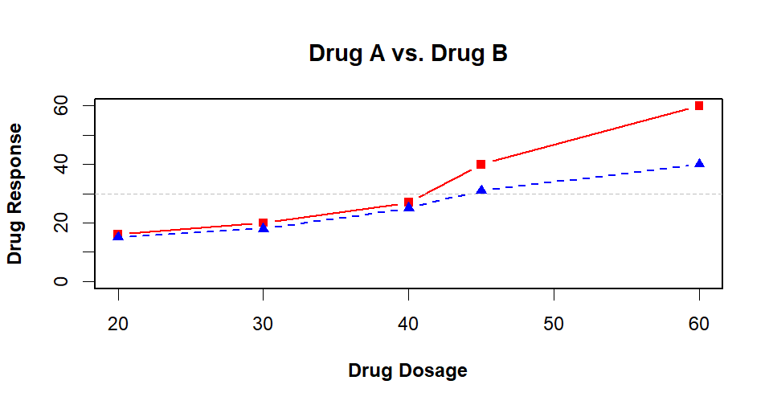
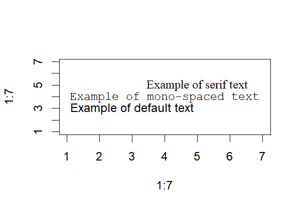
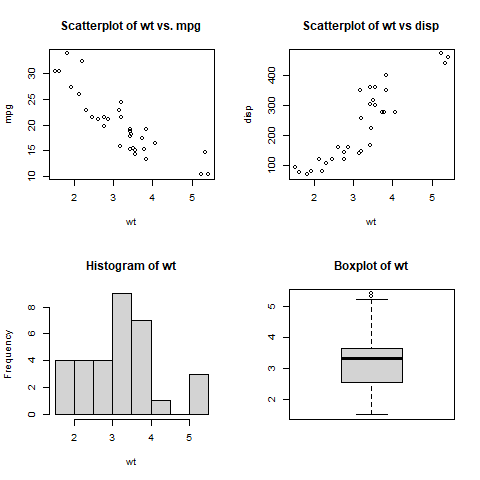
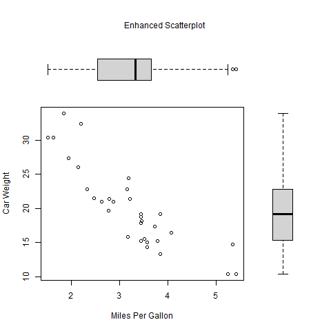

# Getting StaRted with


R is a programming language designed for statistical analysis
and data visualization. 
Like Python, R can also be used as a general-purpose programming language, complete with a menu of data types, 
tools for conditional logic, repetition, functions and methods. 

## Data Types

As with Python, there exist several *classes* of data in ```R```. 


Now let's consider how to define and manipulate these data types in R. 

### Strings

```character``` strings are variables that contain alphanumeric characters, just like type ```str``` in Python. 

```R
my_string <- "abcde"
class(my_string)
"character"
```
Notice that the assignment operator in R is an arrow
made up of the less than sign followed by a dash or minus sign. 
You can also use the equal sign as you would in Python
but the convention in R is only to use the equal sign
for passing arguments to functions. 


### Integer variables

An ```integer``` in R corresponds to type ```str``` in Python. 

```R
some_numbers.integers <- 1:10
class(some_numbers.integers)
[1] "integer"
```
Most characters can be used in variable names
but they must start with a character and not contain operators.
A popular convention is to use only characters separated by
underscores (```_```), and perhaps some integers. 


### Numeric variables

Numeric is a broader class of, well, numeric variables, 
similar to type ```float``` in Python.
```R
value_of_pi <- pi
class(value_of_pi)
[1] "numeric"
```
Note that ```pi``` is a built-in variable in R
but would otherwise be imported into Python
with the ```math``` module.
R, by default, has a set of utilities commonly used for 
statistical analysis and data visualization
but we will see that many R packages are available
to extend R to cover a wide variety of applications. 


### Logical variables

Logical values denote true or false conditions, 
much like type ```bool``` in Python.
```R
true_statement1 <- value_of_pi == pi
class(true_statement1)
[1] "logical"
false_statement1 <- value_of_pi == pi + 2
class(false_statement1)
[1] "logical"
```


## Running Blocks of Code

To interact with R, we will use RStudio, 
which is a graphical user interface (GUI) for R, 
much like Spyder is for Python. 

In RStudio, pressing ctrl + Enter will run the block of code that is selected. It can also be done by clicking the button above marked "Run" with the green arrow. 
To run the blocks of code, select them with your mouse (or using arrows while holding the shift key) before pressing Run (or ctrl + Enter). 
As you gain skill, you will find that you use your mouse less and less and prefer the shift + arrows and ctrl + enter. 

Let's apply the skills above to analyze some data in RStudio. 


## Listing 1.1 - A Sample R session

Before we read in some data from a file,
define some vectors of variables using the c() function.
This function concatenates variables into a vector.

```R
age <- c(1, 3, 5, 2, 11, 9, 3, 9, 12, 3)
weight <- c(4.4, 5.3, 7.2, 5.2, 8.5, 7.3, 6, 10.4,
    10.2, 6.1)
```
You can end a command on the next line
as long as the line terminates with an operator
that indicates an unfinished command.


Now calculate some statistics with these variables.

```R
# Calculate the mean:
mean(weight)
[1] 7.06

# Calculate the standard deviation:
sd(weight)
[1] 2.077498

# Calculate the correlation between two variables:
cor(age, weight)
[1] 0.9075655
```


R comes standard with several tools for
statistical analysis as well as graphics.

```R
plot(age, weight)
```

The default version is a very simple
black-and-white scattergraph but we will learn how to
use R for richer data visualization.


## Listing 1.2 - Managing the R Workspace.

Change the next line to assign ```wd_path``` a valid directory
on your computer.

```R
wd_path <- '~/Teaching/QMB6358_Fall_2020/GitRepos/QMB6358F20/demo_05_R_intro'
setwd(wd_path)
```

We can use the ```runif()``` function to generate
uniformly distributed random variables.
```R
x <- runif(20)
```

The ```summary()``` command is the basic function
for investigating new data.

```R
summary(x)
   Min. 1st Qu.  Median    Mean 3rd Qu.    Max. 
 0.1098  0.3154  0.5103  0.5565  0.7920  0.9605
```

The ```hist()``` function plots a histogram.
```R
hist(x)
```

You can save the history of your commands in a session with
```savehistory()```
and also save the state of your session,
including all the values of variables in memory, with
```save.image()```.

Although useful, this is not recommended
because the state of your workspace can always
be recreated with your data and your script.
You should develop the habit of writing code in a script
so that it preserves your analysis.


## Listing 1.3 - Working with a new package

So far, we have seen several built-in functions.
The full functionality of R is achieved by
installing packages of functions developed
by other users in the R community.

The package vcd is used to Visualizing Categorical Data.
Install packages with the ```install.packages()``` function:

```R
install.packages("vcd")
```

The package needs only be installed once,
unless you want to update the version.
Once installed, you need to attach the package
with the ```library()``` function.

```R
library(vcd)
```

Now, all the functions in the vcd library are available
to use in your workspace.


You can obtain a description of the functions available
in a package.
```
help(package = "vcd")
```
Many packages contain sample datasets to use as examples
of the functionality.
In package ```vcd```, one dataset is a study of treatments for Arthritis. 

```
help(Arthritis)
```


Find the examples corresponding to the datasets with ```example()```

```R
example(Arthritis)
Arthrt> data("Arthritis")

Arthrt> art <- xtabs(~ Treatment + Improved, data = Arthritis, subset = Sex == "Female")

Arthrt> art
         Improved
Treatment None Some Marked
  Placebo   19    7      6
  Treated    6    5     16

Arthrt> mosaic(art, gp = shading_Friendly)
```

You can copy the text for a command that uses this dataset

```R
art <- xtabs(~ Treatment + Improved, data = Arthritis, subset = Sex == "Female")
```

Hit ```<Return>``` to cycle through the plots.


## Getting Help

We saw the help function used above.
It can be used in many ways.
You can find many resources to get you started with help.

```R
help.start()
```

After running this, 
you should see some links in the lower right pane of RStudio. 

Often you need some help specific to a function that you want to use. 
If you know the name of a function, such as ```lm```, you can type either 
```'?'(lm)``` or ```help(lm)``` in the console. 
You can also type keywords in the help window in RStudio. 
If you don't know the keywords, you will often find what you need by searching online with a query like "r linear regression" and you should find that the ```lm``` function is recommended. 
You should know that solutions provided on online fora 
tend to escalate to the most concise or 'elegant' solution,
i.e. *code golf*, which may not make sense to a new user.
Sometimes you want the solution that is most clear.
Over time, you will develop the skill of searching for help
--and work on your golf game, if that is your style.


# Creating a Dataset

Using the ```c()``` function, you can create vectors
with many types of variables.

```R
a <- c(1, 2, 5, 3, 6, -2, 4)
b <- c("one", "two", "three")
c <- c(TRUE, TRUE, TRUE, FALSE, TRUE, FALSE)
```

Once a vector exists in memory,
you can recall any of the elements
by using vector subscripts

```R
> # By the index number:
> a[3]
[1] 5
> # With a vector of index numbers:
> a[c(1, 3, 5)]
[1] 1 5 6
> # By a sequence of consecutive index numbers
> a[2:6]
[1]  2  5  3  6 -2
```

It can often be difficult to remember the element number
you are looking for.
For some data types, such as matrices and arrays,
R allows you to name each row and column
to reference the elements.


## Listing 2.1 - Creating Matrices

Create a matrix with the ```matrix()``` function.
```R
> y <- matrix(1:20, nrow = 5, ncol = 4)
> y
     [,1] [,2] [,3] [,4]
[1,]    1    6   11   16
[2,]    2    7   12   17
[3,]    3    8   13   18
[4,]    4    9   14   19
[5,]    5   10   15   20
```

You can populate the values and name them in one step.

```R
> cells <- c(1, 26, 24, 68)
> rnames <- c("R1", "R2")
> cnames <- c("C1", "C2")
> mymatrix <- matrix(cells, nrow = 2, ncol = 2, byrow = TRUE,
+                   dimnames = list(rnames, cnames))
> mymatrix
   C1 C2
R1  1 26
R2 24 68
```

Now you can call the values by name.
```R
> mymatrix['R2', 'C2']
[1] 68
```

It may be more convenient to enter the values
by cycling through columns one row at a time.

```R
> mymatrix <- matrix(cells, nrow = 2, ncol = 2, byrow = FALSE,
+                    dimnames = list(rnames, cnames))
> mymatrix
   C1 C2
R1  1 24
R2 26 68
```

## Listing 2.2 - Using matrix subscripts

Define another matrix so that we can easily see the pattern.

```R
> x <- matrix(1:10, nrow = 2)
> x
     [,1] [,2] [,3] [,4] [,5]
[1,]    1    3    5    7    9
[2,]    2    4    6    8   10
```

Matrices are two-dimensional objects, so you reference an element
with two indices or names in square brackets.

```R
> x[2, ]
[1]  2  4  6  8 10
> x[, 2]
[1] 3 4
> x[1, 4]
[1] 7
> x[1, c(4, 5)]
[1] 7 9
```

Leaving an index blank selects all values in that dimension.


## Listing 2.3 - Creating an array

You need not stop in two dimensions.
As in Python, you can store data in higher-dimensional arrays.

```R
> dim1 <- c("A1", "A2")
> dim2 <- c("B1", "B2", "B3")
> dim3 <- c("C1", "C2", "C3", "C4")
> z <- array(1:24, c(2, 3, 4), dimnames = list(dim1,
+                                              dim2, dim3))
> z
, , C1

   B1 B2 B3
A1  1  3  5
A2  2  4  6

, , C2

   B1 B2 B3
A1  7  9 11
A2  8 10 12

, , C3

   B1 B2 B3
A1 13 15 17
A2 14 16 18

, , C4

   B1 B2 B3
A1 19 21 23
A2 20 22 24
```

The notation is similar to that for matrices.


## Listing 2.4 - Creating a dataframe

For tstatistical analysis, the most useful data type
is a data frame, which can hold several types of data together.

```R
> patientID <- c(1, 2, 3, 4)
> age <- c(25, 34, 28, 52)
> diabetes <- c("Type1", "Type2", "Type1", "Type1")
> status <- c("Poor", "Improved", "Excellent", "Poor")
> patientdata <- data.frame(patientID, age, diabetes,
+                           status)
> patientdata
  patientID age diabetes    status
1         1  25    Type1      Poor
2         2  34    Type2  Improved
3         3  28    Type1 Excellent
4         4  52    Type1      Poor
```

A data frame contains data organized into columns
with each column holding a variable of the same type.


## Listing 2.5 - Specifying elements of a dataframe

As with matrices, you can reference elements
by name or by number.

```R
> patientdata[1:2]
  patientID age
1         1  25
2         2  34
3         3  28
4         4  52
> patientdata[c("diabetes", "status")]
  diabetes    status
1    Type1      Poor
2    Type2  Improved
3    Type1 Excellent
4    Type1      Poor
> patientdata$age
[1] 25 34 28 52
```


## Listing 2.6 - Using factors

The data type ```"factor"``` is used to store categorical data,
which often arises in statistical analysis.

```R
patientID <- c(1, 2, 3, 4)
age <- c(25, 34, 28, 52)
diabetes <- c("Type1", "Type2", "Type1", "Type1")
status <- c("Poor", "Improved", "Excellent", "Poor")
diabetes <- factor(diabetes)
status <- factor(status, order = TRUE)
patientdata <- data.frame(patientID, age, diabetes,
                          status)
```

Inspect the contents of this data frame.


```R
> str(patientdata)
'data.frame':	4 obs. of  4 variables:
 $ patientID: num  1 2 3 4
 $ age      : num  25 34 28 52
 $ diabetes : Factor w/ 2 levels "Type1","Type2": 1 2 1 1
 $ status   : Ord.factor w/ 3 levels "Excellent"<"Improved"<..: 3 2 1 3
> summary(patientdata)
   patientID         age         diabetes       status 
 Min.   :1.00   Min.   :25.00   Type1:3   Excellent:1  
 1st Qu.:1.75   1st Qu.:27.25   Type2:1   Improved :1  
 Median :2.50   Median :31.00             Poor     :2  
 Mean   :2.50   Mean   :34.75                          
 3rd Qu.:3.25   3rd Qu.:38.50                          
 Max.   :4.00   Max.   :52.00
```


##  Listing 2.7 - Creating a list

A ```"list"``` is a special type of object that can store
multiple kinds of data in an unstructured way.

```R
> g <- "My First List"
> h <- c(25, 26, 18, 39)
> j <- matrix(1:10, nrow = 5)
> k <- c("one", "two", "three")
> mylist <- list(title = g, ages = h, j, k)
> mylist
$title
[1] "My First List"

$ages
[1] 25 26 18 39

[[3]]
     [,1] [,2]
[1,]    1    6
[2,]    2    7
[3,]    3    8
[4,]    4    9
[5,]    5   10

[[4]]
[1] "one"   "two"   "three"
```

You can inspect the contents with commands similar
to those for matrices and data frames.

```R
> mylist$title
[1] "My First List"
> mylist$ages
[1] 25 26 18 39
> mylist[4]
[[1]]
[1] "one"   "two"   "three"
```

Notice that the last two elements are unnamed
but are still referenced by number. 

# Getting StaRted with Graphs in R

R has an extensive suite of functions for graphics. 
The variable ```par``` stores parameter for displaying graphics either on screen in the "Plot" window, 
which is in the lower right pane in RStudio,
or directly into files.

One parameter specifies a pause after each graph
```R
par(ask = TRUE)
```

If you find it annoying to press ```<Enter>```
between each graph, you can switch this feature off with 
```R
par(ask = FALSE)
```


## --Section 3.1--

Attach a dataset from a library with
examples of data about cars.

```R
attach(mtcars)
```

Now plot the weight and miles per gallon.
```R
plot(wt, mpg)
```

Using the ```lm()``` function, you can estimate a linear model,
i.e. a linear regression model.
Placing the call to ```lm()``` in ```abline``` appends the
estimated regression line through the observations.


```R
abline(lm(mpg ~ wt))
```

Notice that ```abline()``` appended a line to the existing plot,
after the plot object was created by ```plot()```.

You can add other deatures to an open plot,
including titles and legends.
```R
title("Regression of MPG on Weight")
```



When you no longer need the data, you can detach the dataset.
```R
detach(mtcars)
```


## --Section 3.2--

Create some data and plot them.

```R
dose <- c(20, 30, 40, 45, 60)
drugA <- c(16, 20, 27, 40, 60)
drugB <- c(15, 18, 25, 31, 40)
plot(dose, drugA, type = "b")
```


You can specify the type of plot as points 
(```'p'```, the default),
line (```'l'```) or both (```'b'```).


## --Section 3.3--


You can also specify parameters for the type of line (```lty```)
and the symbol used for the points.
```R
plot(dose, drugA, type = "b", lty = 2, pch = 17)
```




The ```lwd``` argument changes the line width
and the ```cex``` argument changes the size of the points.
```R
plot(dose, drugA, type = "b", lty = 3, lwd = 3, pch = 15,
     cex = 2)
```




To plot several series, you can use a sequence of colors
specified by the rainbow() function.
```R
n <- 10
mycolors <- rainbow(n)
pie(rep(1, n), labels = mycolors, col = mycolors)
```


For documents in black and white, use the grey scale.
```R
mygrays <- gray(0:n/n)
pie(rep(1, n), labels = mygrays, col = mygrays)
```


## Listing 3.1 - Using graphical parameters to control graph appearance

You can also set global graphical parameters with the ```par()``` function.

Create some data.
```R
dose <- c(20, 30, 40, 45, 60)
drugA <- c(16, 20, 27, 40, 60)
drugB <- c(15, 18, 25, 31, 40)
```

First, store the existing parameter settings.
```R
opar <- par(no.readonly = TRUE)
```R
We will reinstate them later.

Customize the settings.
```R
par(pin = c(2, 3))
par(lwd = 2, cex = 1.5)
par(cex.axis = 0.75, font.axis = 3)
```
Now these settings are the defaults for the next plots.

```R
plot(dose, drugA, type = "b", pch = 19, lty = 2, col = "red")
```


If you get an error or warning message,
try resizing the "Plot" window in the bottom right
by dragging the edges of the window.


```R
plot(dose, drugB, type = "b", pch = 23, lty = 6, col = "blue",
    bg = "green")
```


Revert back to the default parameter settings we had earlier.
```R
par(opar)
```

## --Section 3.4--


You can add labels on the axes, a title
and set the ranges in the x and y directions.
```R
plot(dose, drugA, type = "b", col = "red", lty = 2,
    pch = 2, lwd = 2, main = "Clinical Trials for Drug A",
    sub = "This is hypothetical data",
    xlab = "Dosage", ylab = "Drug Response", xlim = c(0, 60),
    ylim = c(0, 70))
```


## Listing 3.2 - An Example of Custom Axes

Create an example with multiple relationships
to plot together.
```R
x <- c(1:10)
y <- x
z <- 10/x
```

As above, store and change the parameter settings.
```R
opar <- par(no.readonly = TRUE)
par(mar = c(5, 4, 4, 8) + 0.1)
```

Now create an example with multiple plots
and customized axis labels.
```R
plot(x, y, type = "b", pch = 21, col = "red", yaxt = "n",
    lty = 3, ann = FALSE)
lines(x, z, type = "b", pch = 22, col = "blue", lty = 2)
axis(2, at = x, labels = x, col.axis = "red", las = 2)
axis(4, at = z, labels = round(z, digits = 2), col.axis = "blue",
    las = 2, cex.axis = 0.7, tck = -0.01)
mtext("y=1/x", side = 4, line = 3, cex.lab = 1, las = 2,
    col = "blue")
title("An Example of Creative Axes", xlab = "X values",
    ylab = "Y=X")
```


It helps to run the above commands one at a time to
see what each command adds to the plot.

Reset the graphical parameters.
```R
par(opar)
```

## Listing 3.3 - Comparing Drug A and Drug B response by dose

Reconsider our clinical data.
```R
dose <- c(20, 30, 40, 45, 60)
drugA <- c(16, 20, 27, 40, 60)
drugB <- c(15, 18, 25, 31, 40)
```

Store and set the graphical parameters.
```R
opar <- par(no.readonly = TRUE)
par(lwd = 2, cex = 1.5, font.lab = 2)
```

Now plot the effectiveness of the two drugs
and add a line to show a threshold with a dotted line.
```R
plot(dose, drugA, type = "b", pch = 15, lty = 1, col = "red",
    ylim = c(0, 60), main = "Drug A vs. Drug B", xlab = "Drug Dosage",
    ylab = "Drug Response")
lines(dose, drugB, type = "b", pch = 17, lty = 2,
    col = "blue")
abline(h = c(30), lwd = 1.5, lty = 2, col = "grey")
```

Again, you might need to resize the "Plot" window.
Click the "Zoom" button to display
the plot in a separate window.




Now reset the default graphical parameters.
```R
par(opar)
```

## --Section 3.4.5--

You can also label points with text.

```R
attach(mtcars)
plot(wt, mpg, main = "Milage vs. Car Weight", xlab = "Weight",
    ylab = "Mileage", pch = 18, col = "blue")
text(wt, mpg, row.names(mtcars), cex = 0.6, pos = 4,
    col = "red")
detach(mtcars)
```
It is a good habit to remove datsets with detach()
after you are finished with them.


You can add the text in a variety of font families
```R
opar <- par(no.readonly = TRUE)
par(cex = 1.5)
plot(1:7, 1:7, type = "n")
text(3, 3, "Example of default text")
text(4, 4, family = "mono", "Example of mono-spaced text")
text(5, 5, family = "serif", "Example of serif text")
par(opar)
```


## --Section 3.5--

So far, we have considered one plot at a time,
you can place multiple plots in rows or columns.

## Figure 3.14

Since this figure is too large to display in the plot window,
I will save it to a directory.
```R
setwd('C:path/to/my/chosen/directory')
```
Then the ```png()``` function will save the plot in
a chosen file name.

```R
attach(mtcars)
opar <- par(no.readonly = TRUE)
```

Look for the image file in your chosen directory.
```R
png('tiled_plot.png')
par(mfrow = c(2, 2))
plot(wt, mpg, main = "Scatterplot of wt vs. mpg")
plot(wt, disp, main = "Scatterplot of wt vs disp")
hist(wt, main = "Histogram of wt")
boxplot(wt, main = "Boxplot of wt")
# The dev.off() function redirects plots to the window
# and closes the png file.
dev.off()

# Reset the parameters.
par(opar)
detach(mtcars)
```



## Figure 3.15

You can choose different dimensions
for the pattern of the plots.
This example plots three histograms
arranged along rows in a single column.

```R
attach(mtcars)
opar <- par(no.readonly = TRUE)

png('column_plot.png')
par(mfrow = c(3, 1))
hist(wt)
hist(mpg)
hist(disp)
dev.off()

par(opar)
detach(mtcars)
```


## Figure 3.16

The plots do not always have to be the same size.
The layout() command maps the first plot to the first two
spaces in the first row of plots.

```R
attach(mtcars)
png('layout_plot.png')

layout(matrix(c(1, 1, 2, 3), 2, 2, byrow = TRUE))
hist(wt)
hist(mpg)
hist(disp)
dev.off()

detach(mtcars)
```


## Figure 3.17

The relative sizes of plots can be specified separately.

```R
attach(mtcars)

png('layout_plot_resized.png')
layout(matrix(c(1, 1, 2, 3), 2, 2, byrow = TRUE),
    widths = c(3, 1), heights = c(1, 2))
hist(wt)
hist(mpg)
hist(disp)
dev.off()

detach(mtcars)
```


## Listing 3.4 - Fine placement of figures in a graph

```R
opar <- par(no.readonly = TRUE)

png('fine_placement_plot.png')
par(fig = c(0, 0.8, 0, 0.8))
plot(mtcars$wt, mtcars$mpg, xlab = "Miles Per Gallon",
    ylab = "Car Weight")
par(fig = c(0, 0.8, 0.55, 1), new = TRUE)
boxplot(mtcars$wt, horizontal = TRUE, axes = FALSE)
par(fig = c(0.65, 1, 0, 0.8), new = TRUE)
boxplot(mtcars$mpg, axes = FALSE)
mtext("Enhanced Scatterplot", side = 3, outer = TRUE,
    line = -3)
dev.off()

par(opar)
```



That's a lot of plots to get you StaRted with graphs in R.


